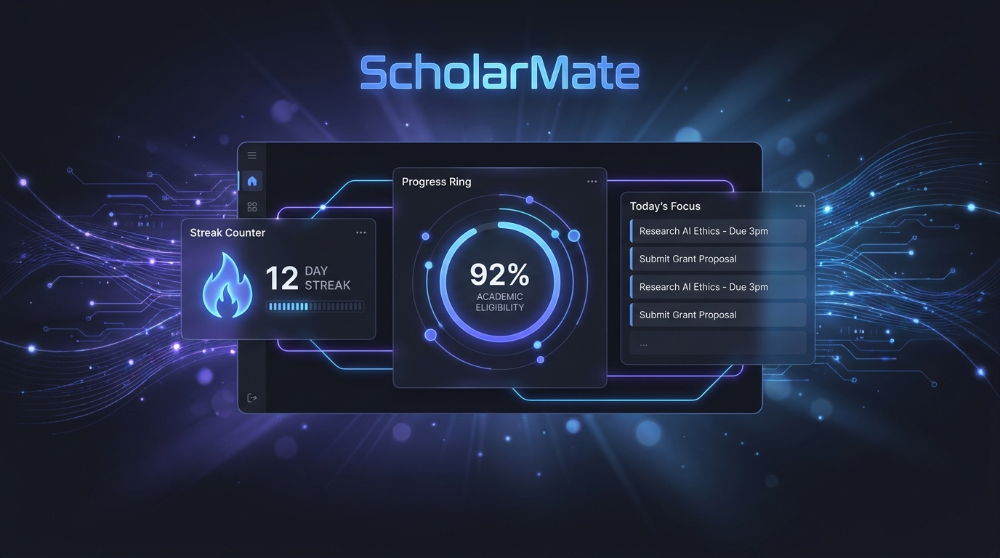
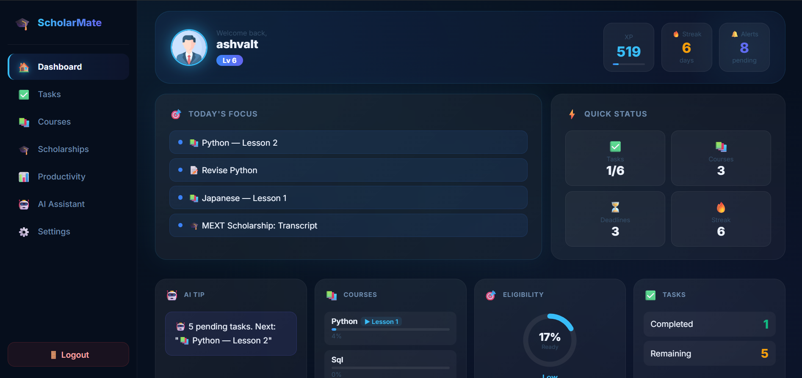

<p align="center">
  
</p>

<h1 align="center">🎓 ScholarMate</h1>

<p align="center">
AI-Powered Student Productivity & Scholarship Management Platform
</p>

<p align="center">


</p>
# 🎓 ScholarMate AI

> An AI-Powered Scholarship & Study Management Platform that helps students organize coursework, monitor scholarship eligibility, manage deadlines, and receive personalized AI assistance.

---

## 🌐 Live Demo

 🔗 [ScholarMate Live Website](https://scholarmatelive.netlify.app)

---

## 💻 GitHub Repository

🔗 https://github.com/valtrok10/ScholarMate

---

# 📖 About

ScholarMate is a full-stack AI-powered web application designed to help students stay organized throughout their academic journey.

Instead of juggling multiple apps, ScholarMate combines:

- 📚 Course Tracking
- 🎓 Scholarship Tracking
- 📅 Deadline Management
- 🤖 AI Academic Assistant
- 🔥 Productivity Dashboard
- 🎯 XP & Gamification

into one intelligent platform.

---

# ✨ Features

## 🔐 Authentication

- Firebase Authentication
- Secure Login
- Secure Signup
- Password Reset
- User Profiles

---

## 📚 Course Management

- Add Courses
- Track Progress
- Lesson Completion
- Progress Percentage

---

## 🎓 Scholarship Tracker

- Add Scholarships
- Track Requirements
- Eligibility Percentage
- Deadline Monitoring

---

## 🤖 AI Assistant

Powered by:

- OpenRouter API
- DeepSeek Chat

The AI can:

- Answer academic questions
- Recommend study plans
- Analyze scholarship readiness
- Suggest next tasks
- Provide productivity advice

---

## 📊 Dashboard

- XP System
- Productivity Tracker
- Today's Tasks
- Streak Counter
- Progress Charts

---

# 🛠 Tech Stack

## Frontend

- HTML5
- CSS3
- JavaScript (ES6)

## Backend

- Node.js
- Express.js

## Database

- Firebase Firestore

## Authentication

- Firebase Authentication

## AI

- OpenRouter
- DeepSeek Chat

## Deployment

- Netlify
- Render

## Version Control

- Git
- GitHub

---

# 📂 Project Structure

```
ScholarMate/
│
├── assets/
├── backend/
│   ├── server.js
│   ├── package.json
│   └── .env
│
├── css/
├── js/
├── auth.js
├── config.js
├── script.js
├── index.html
└── README.md
```

---

# 🔒 Security

- Firebase Authentication
- Firestore Security Rules
- API Key stored in `.env`
- Backend Proxy
- No API Keys exposed to frontend

---

# 🚀 Future Improvements

- AI Chat History
- Email Verification
- PDF Export
- Mobile App
- Calendar Sync
- AI Study Planner

---
# 📸 Screenshots

## Dashboard



---

## AI Assistant


---

## Scholarship Tracker


---

## Course Tracker


---

## Productivity Dashboard


# 👨‍💻 Author

**Maheshwar Siva M**

B.Tech – Artificial Intelligence & Data Science

KCG College of Technology
